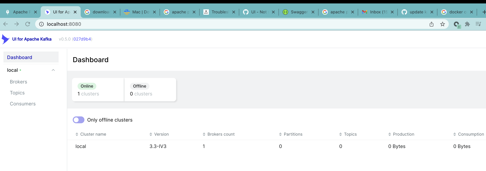
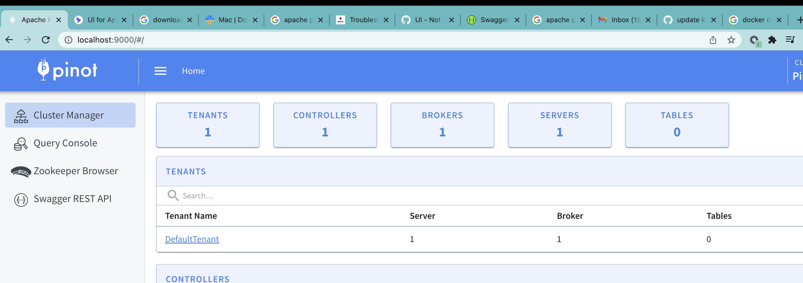

# de-fullstack project


## Data generation
CSV and custom API developed in [de-fullstack-api](https://github.com/knvsk/de-fullstack-api)
## Data stream store
#### Apache Kafka
 - **kafka-ui**
   In order to monitor the health and status of brokers, topics and consumers `kafka-ui` is used. More [here](https://github.com/provectus/kafka-ui).
   <br>
   Screenshot:
   

## Data stream processing
#### Apache Spark

## Apache Pinot
   Screenshot:
   


# Get started
1. Run
```
docker-compose -f docker-compose-kafka.yml -f docker-compose-pinot.yml up
```

